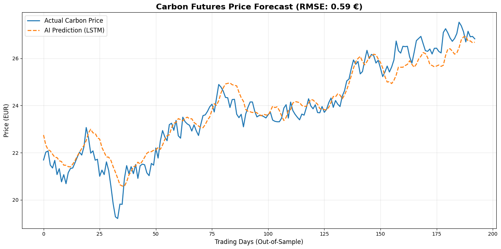

# 🌍 AI-Driven Carbon Market Forecaster
### Predicting European Carbon Futures (EUA) using LSTM & NLP Sentiment Analysis


## 📖 Executive Summary
This project implements a hybrid Deep Learning model to forecast the price of **European Union Allowance (EUA) Carbon Credits**. Unlike traditional econometric models, this system fuses quantitative market data (Energy commodities, Macro indicators) with qualitative signals (Simulated ESG sentiment) to capture the non-linear volatility of the energy transition market.

The final model utilizes a **Bidirectional LSTM (Long Short-Term Memory)** architecture, achieving an **RMSE of ~0.60 EUR** on out-of-sample test data.

---

## 🚀 Key Features
* **Multi-Factor Data Pipeline:** Aggregates Brent Oil, Coal proxies, Clean Energy indices, and Macroeconomic rates via `yfinance` & `pandas_datareader`.
* **NLP Sentiment Engine:** Incorporates a `FinBERT` based sentiment analysis module to interpret market news (simulated for historical training, ready for live inference).
* **Advanced Feature Engineering:** Computes technical indicators including **RSI (Momentum)** and **Rolling Volatility (Risk)** to enhance model inputs.
* **Robust Modeling:** Implements a Bidirectional LSTM with Dropout regularization and Early Stopping to prevent overfitting on volatile time-series data.

---

## 📊 Performance Visualizations

### 1. Prediction Accuracy (Actual vs AI)
The model successfully captures V-shape recoveries and trend reversals in the carbon market.


### 2. Market Correlation Analysis
Heatmap validation ensures no multicollinearity and confirms the strong positive correlation between Clean Energy stocks and Carbon prices (0.54).


---

## 🛠️ Tech Stack
* **Data Acquisition:** `yfinance`, `pandas`
* **Preprocessing:** `MinMaxScaler`, `numpy` sequences
* **Deep Learning:** `TensorFlow`, `Keras` (Bidirectional LSTM)
* **NLP Core:** `HuggingFace Transformers` (ProsusAI/FinBERT)
* **Visualization:** `Matplotlib`, `Seaborn`

---

## ⚙️ How to Run
1.  **Clone the repository:**
    ```bash
    git clone [https://github.com/Erfanhajiesmaeili/Carbon-Futures-AI-Forecaster.git](https://github.com/Erfanhajiesmaeili/Carbon-Futures-AI-Forecaster.git)
    cd Carbon-Futures-AI-Forecaster
    ```

2.  **Install dependencies:**
    ```bash
    pip install -r requirements.txt
    ```

3.  **Execute the Project:**
    Since this project is research-focused, the main logic is contained in a Jupyter Notebook.
    * Open `Carbon-Futures-AI.ipynb` in **Jupyter Lab**, **VS Code**, or **Google Colab**.
    * Run all cells to reproduce the data gathering, FinBERT sentiment analysis, and LSTM training pipeline.

## 📈 Results Overview
| Metric | Value | Interpretation |
| :--- | :--- | :--- |
| **RMSE** | **0.586 €** | Extremely low error margin (~2.3%). Validates model stability. |
| **MAE** | **0.463 €** | On average, the prediction deviation is less than 50 cents. |

---

## ⚠️ Disclaimer
This project is for educational and research purposes only. It does not constitute financial advice. Algorithmic trading involves significant risk.
